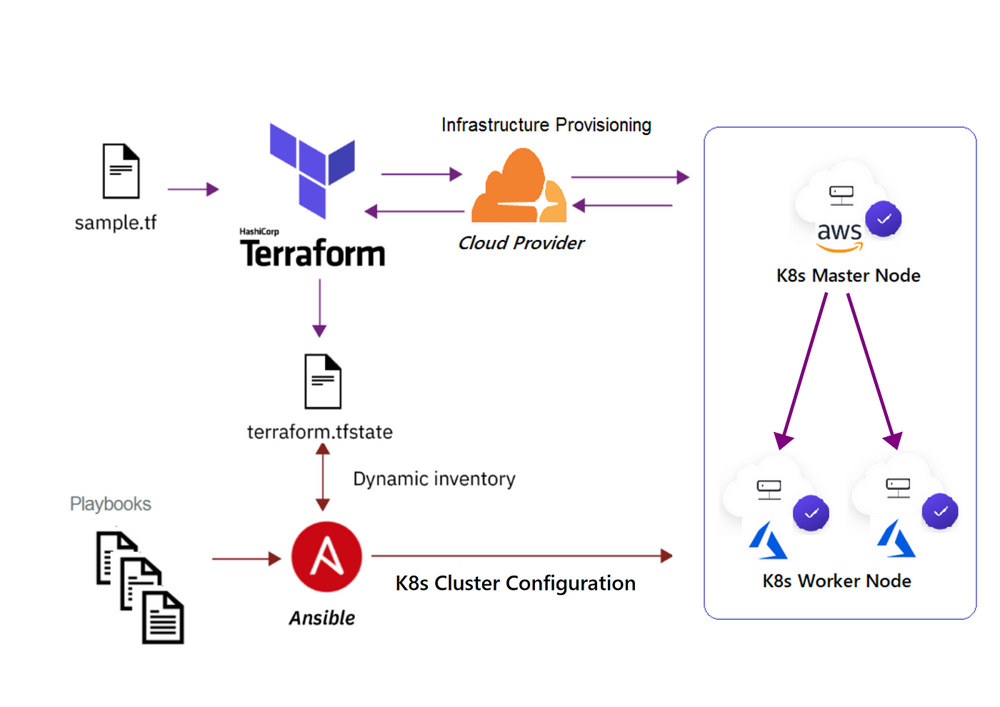

# Automate Provisioning and Deployment with Jenkins, Terraform, and Ansible (with AWS Auto Scaling & ALB)

This repository provides a complete CI/CD pipeline to provision AWS infrastructure using **Terraform**, configure and deploy applications using **Ansible**, and orchestrate the process with **Jenkins**. It leverages AWS Auto Scaling Groups (ASG) for scalable, production-grade infrastructure, and integrates the AWS Application Load Balancer (ALB) for high availability and traffic management.

---

## Table of Contents

- [Overview](#overview)
- [Prerequisites](#prerequisites)
- [Setup Instructions](#setup-instructions)
  - [1. Jenkins Credentials Setup](#1-jenkins-credentials-setup)
  - [2. Terraform Infrastructure Provisioning](#2-terraform-infrastructure-provisioning)
  - [3. Fetching Terraform Outputs](#3-fetching-terraform-outputs)
  - [4. Ansible Inventory Generation](#4-ansible-inventory-generation)
  - [5. Establish Passwordless SSH](#5-establish-passwordless-ssh)
  - [6. AWS CLI Installation on EC2](#6-aws-cli-installation-on-ec2)
  - [7. Docker Image Deployment](#7-docker-image-deployment)
  - [8. AWS Load Balancer Controller IAM Policy](#8-aws-load-balancer-controller-iam-policy)
  - [9. Jenkins Master and Agent Setup](#9-jenkins-master-and-agent-setup)
- [Jenkins Pipeline](#jenkins-pipeline)
- [Best Practices](#best-practices)
- [Troubleshooting](#troubleshooting)
- [References](#references)
- [Author](#author)

---

## Overview

- **Terraform** provisions VPC, subnets, security groups, IAM roles, and creates AWS Auto Scaling Groups (ASG) with Launch Templates for Kubernetes master and worker nodes.
- **Jenkins** orchestrates the pipeline, running Terraform and Ansible steps, and dynamically generates Ansible inventory and variable files.
- **Ansible** configures EC2 instances, installs Kubernetes, Docker, AWS CLI, and deploys containers.
- **Auto Scaling** ensures your Kubernetes nodes are highly available and can scale as needed.
- **ALB (Application Load Balancer)** provides scalable, highly available traffic routing to your Kubernetes workloads.
- **SSH keys** are managed securely via Jenkins credentials; passwordless SSH is established automatically.

---

## Prerequisites

- Jenkins server with:
  - **Pipeline Utility Steps Plugin** (for `readJSON`)
  - **SSH Agent Plugin** (recommended)
- AWS account with proper IAM permissions
- Terraform (>= 1.3) and Ansible installed on Jenkins agents
- Docker installed on EC2 instances (via Ansible)
- PEM private key file for EC2 SSH access
- **Jenkins master node** (controller) and at least one Jenkins agent (worker) for distributed builds (see [Jenkins Master and Agent Setup](#9-jenkins-master-and-agent-setup))

---

## Setup Instructions

### 1. Jenkins Credentials Setup

- Add your PEM private key as a **Secret file** credential in Jenkins (e.g., `terraform_ansible.pem`).
- Add your GitHub token as **username and password** credentials (`github-repo`).
- Install the Jenkins `Pipeline Utility Steps` plugin.

### 2. Terraform Infrastructure Provisioning

- Use Terraform code to define AWS infrastructure, including ASG and Launch Templates.
- Example using [terraform-aws-modules/autoscaling/aws](https://github.com/terraform-aws-modules/terraform-aws-autoscaling):


```
module "asg" {
source = "terraform-aws-modules/autoscaling/aws"

name = "k8s-worker-asg"
min_size = 3
max_size = 6
desired_capacity = 3
vpc_zone_identifier = [module.vpc.public_subnet_ids]
launch_template_name = "k8s-worker-template"
image_id = "ami-xxxxxxx"
instance_type = "t3.medium"
security_groups = [aws_security_group.k8s.id]

... other settings ...
}

```

- Outputs should include:
  - `master_ips`, `worker_ips` (public/private as needed)
  - Network components (VPC, subnets, route tables)

### 3. Fetching Terraform Outputs

- Use `terraform output -json master_ips` and `terraform output -json worker_ips` to get instance IPs.
- Store output JSON in environment variables for later use.

### 4. Ansible Inventory Generation

- Parse the JSON IP lists with `readJSON` in Jenkins.
- Generate a dynamic inventory YAML file inside the `ansible` directory.
- Reference the PEM file path securely in inventory using environment variables.

### 5. Establish Passwordless SSH

- Generate the public key from the PEM file if not already present.
- Wait for SSH availability on each EC2 instance before copying keys.
- Use `ssh-copy-id` to copy the public key to EC2 instances.
- Clean up `known_hosts` with `ssh-keygen -R`.
- Retry SSH connection until successful.

### 6. AWS CLI Installation on EC2

- Install `unzip` package first.
- Download AWS CLI v2 installer using `curl`.
- Extract and install AWS CLI v2 using the official bundled installer.
- Avoid installing AWS CLI via `pip` or `apt` to prevent environment conflicts.

### 7. Docker Image Deployment

- Define Docker images and container metadata in variables.
- Pull Docker images using `docker pull`.
- Run Docker containers conditionally based on inventory hostname.
- Prefer using Ansible `community.docker` modules for idempotency.

### 8. AWS Load Balancer Controller IAM Policy

- **Create and attach the [official AWS Load Balancer Controller IAM policy](https://github.com/kubernetes-sigs/aws-load-balancer-controller/releases/latest/download/iam_policy.json) to all EC2 nodes:**

```
resource "aws_iam_policy" "aws_load_balancer_controller" {
name = "AWSLoadBalancerControllerIAMPolicy"
description = "Policy for AWS Load Balancer Controller on self-managed Kubernetes"
policy = file("iam_policy.json")
}

```

- Attach this policy to your node IAM role.  
- This is required for the AWS Load Balancer Controller to manage ALBs and register targets.

### 9. Jenkins Master and Agent Setup

- **Jenkins Master (Controller):**  
  - Orchestrates the pipeline, manages job scheduling, and stores configuration.
- **Jenkins Agent (Worker):**  
  - Executes pipeline steps (Terraform, Ansible, kubectl, etc.) on provisioned EC2 instances (can be dynamically scaled via ASG).
- **Recommended:**  
  - Use the Jenkins master for orchestration and a dedicated agent (with the label `master` or custom) for all deployment steps.
  - Ensure the agent has all required tools (`kubectl`, `aws`, `helm`, `jq`, etc.) and access to the kubeconfig.

---

## Jenkins Pipeline

- Checks out the repository
- Runs Terraform init, plan, and apply
- Fetches Terraform outputs for master and worker IPs
- Generates Ansible inventory and variable files dynamically
- Establishes passwordless SSH to EC2 instances
- Runs Ansible playbook to configure the cluster
- Installs and configures the AWS Load Balancer Controller and patches providerID for all nodes

---

## Best Practices

- **Secure PEM key management:** Use Jenkins credentials and avoid printing secrets.
- **Wait for SSH readiness:** Retry SSH connections before copying keys.
- **Use official AWS CLI installer:** Avoid pip/apt for AWS CLI v2.
- **Avoid Jinja2 in variables:** Build commands dynamically in tasks.
- **Use Ansible modules for Docker:** Prefer `community.docker` modules for idempotency.
- **Isolate Ansible directory:** Keep inventory and playbooks organized under `ansible/`.
- **Patch providerID automatically:** Use Jenkins shell steps to patch all nodes for ALB integration.

---

## Troubleshooting

| Issue | Cause | Solution |
|---------------------------------------|-----------------------------------------------|----------------------------------------------|
| `No such DSL method 'readJSON'` | Missing Pipeline Utility Steps Plugin | Install plugin in Jenkins |
| PEM file path masked as `****` | Groovy string interpolation with secrets | Use single quotes and `$PEM_FILE` in shell |
| SSH-copy-id fails first run | SSH service not ready on EC2 | Add SSH wait/retry loop before copying keys |
| AWS CLI install errors | Python 3.12+ PEP 668 restrictions | Use official AWS CLI v2 bundled installer |
| `unzip` command missing | `unzip` not installed on EC2 | Install `unzip` package via apt |
| Jinja2 templating inside variables | Ansible does not recursively render variables | Build commands in tasks, not in variable defs|
| ALB not created | Missing subnet tags, providerID, or IAM policy | Tag subnets, patch providerID, check IAM policy |
| ALB targets unhealthy | Pod not reachable, wrong service type | Use NodePort for ALB, check security groups |

---

## References

- [Terraform AWS Autoscaling Module](https://github.com/terraform-aws-modules/terraform-aws-autoscaling)
- [Jenkins Pipeline Utility Steps Plugin](https://plugins.jenkins.io/pipeline-utility-steps/)
- [Ansible Docker Collection](https://docs.ansible.com/ansible/latest/collections/community/docker/docker_container_module.html)
- [AWS CLI Installation Guide](https://docs.aws.amazon.com/cli/latest/userguide/getting-started-install.html)
- [AWS Load Balancer Controller IAM Policy](https://github.com/kubernetes-sigs/aws-load-balancer-controller/releases/latest/download/iam_policy.json)
- [Jenkins Master-Agent Architecture](https://varunmargam.hashnode.dev/efficient-cicd-with-jenkins-exploring-master-slave-architecture-and-agents)

---

## Author

Chandramani

---

## Overview Diagram



---

**Note:**  
This repository demonstrates a production-grade, scalable, and automated infrastructure provisioning and deployment pipeline using industry best practices, AWS Auto Scaling, and ALB integration.
